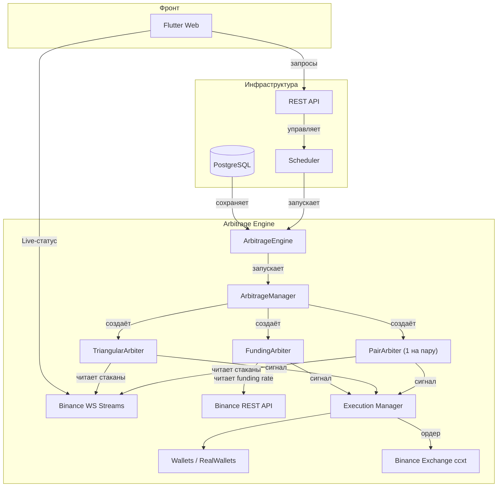

# 📋 План: Arbitrage Engine — единый движок для арбитражной торговли

> **Цель:** Создать отдельный движок для арбитражной торговли, поддерживающий 3 типа стратегий: треугольный арбитраж (triangular), funding rate арбитраж (funding-rate), статистический арбитраж пар (pairs-trading). Движок работает параллельно с OB-системой, но использует общую инфраструктуру (Wallets, scheduler, API).

---

## Оглавление

1. [Архитектура](#архитектура)
2. [Типы стратегий](#типы-стратегий)
3. [Фазы реализации](#фазы-реализации)
4. [Инфраструктура и нюансы](#инфраструктура-и-нюансы)
5. [Файловая структура](#файловая-структура)
6. [Оценка времени](#оценка-времени)

---

## Архитектура



### Компоненты

| Компонент | Назначение |
|-----------|------------|
| `ArbitrageManager` | Главный оркестратор — запускает арбитров, собирает профиты, управляет жизненным циклом |
| `PairArbiter` | Статистический арбитраж одной пары (SOL/ETH) — z-score, cointegration |
| `TriangularArbiter` | Треугольный арбитраж — ищет циклы из 3+ монет |
| `FundingArbiter` | Funding rate арбитраж — спот + перпетуал |
| `ExecutionManager` | Исполнение сделок — virtual или real, управление рисками |
| `ArbitrageConfig` | Конфигурация запуска — какие стратегии, пороги, лимиты |

### Отличия от OB Engine

| Аспект | OB Engine | Arbitrage Engine |
|--------|-----------|------------------|
| Поток данных | Один стакан, одна пара | 3+ стакана одновременно (или REST funding rate) |
| Тип сигнала | Дисбаланс/спред/моментум | Ценовые треугольники / z-score / funding rate |
| Вход | Один market order | 2-3 ордера одновременно (все ноги треугольника) |
| Удержание | Секунды-минуты | Минуты-дни (для статистического) |
| Риски | Проскальзывание | Latency-гонка, рассинхронизация ног |

---

## Типы стратегий

### Стратегия A: Треугольный арбитраж (Triangular)

**Принцип:** Три шага внутри одной биржи:
```
USDT → BTC → ETH → USDT
```
Профит, если конечный USDT > начального.

**Когда работает:**
- Моменты высокой волатильности
- После крупных новостей
- Редко (единицы раз в час)

**Параметры:**
| Параметр | Default | Описание |
|----------|---------|----------|
| `min_profit_pct` | 0.3% | Минимальный профит после комиссий (0.1% спот + 0.1% спот) |
| `max_slippage_pct` | 0.1% | Допустимое проскальзывание на ногу |
| `cooldown_seconds` | 30 | Пауза между треугольниками |
| `max_hops` | 3 | Длина цикла (только 3 ноги) |
| `triangles_file` | — | Путь к JSON с треугольниками |

**Откуда брать треугольники:**
- Binance имеет ~200 USDT-пар
- Из них отбираем top-20 по ликвидности
- Генерируем все возможные треугольники: `USDT → A → B → USDT`
- Фильтруем: каждый шаг — парная торговля с комиссией <0.15%

**Исполнение:**
```python
async def execute_triangle(self, triangle):
    """Три market order-а почти одновременно."""
    order1 = await self.exchange.create_market_buy(triangle.leg1)
    order2 = await self.exchange.create_market_buy(triangle.leg2)
    order3 = await self.exchange.create_market_sell(triangle.leg3)
    # Если хоть один не заполнился — откат (в virtual режиме — ошибка)
```

**Latency-нюансы:**
- От home ПК до Binance: ~80-150ms
- За это время треугольник может исчезнуть
- **Решение:** VPS рядом с биржей (AWS Frankfurt ~1-2ms)
- **Или:** порог профита ×2 (0.6% вместо 0.3%)

**Зоны треугольника:**
```
         BTC
        /   \
       /     \
      v       v
    USDT <--- ETH

    Нога 1: USDT → BTC  (buy BTC/USDT)
    Нога 2: BTC → ETH   (sell BTC/ETH или buy ETH/BTC)
    Нога 3: ETH → USDT  (sell ETH/USDT)
```

---

### Стратегия B: Funding Rate арбитраж (Funding Rate)

**Принцип:** 
1. Покупаем спот (например 1 ETH)
2. Шортим 1 ETH на перпетуальном рынке (ETHUSDT Perpetual)
3. Собираем funding rate каждые 8 часов
4. Когда ставка падает → закрываем

**Доходность (реалистичная):**
| Уровень | Funding rate avg | Доход/день (на $1000) |
|---------|-----------------|----------------------|
| Низкий | 0.01% | ~$0.10 |
| Средний | 0.03% | ~$0.30 |
| Высокий | 0.10% | ~$1.00 |

**Параметры:**
| Параметр | Default | Описание |
|----------|---------|----------|
| `min_funding_rate` | 0.01% | Минимальная ставка для входа |
| `exit_funding_rate` | 0.005% | Ставка для выхода (ниже = закрываем) |
| `max_hold_hours` | 72 | Максимальное удержание позиции |
| `leverage` | 1x | Без плеча (hedged) |
| `pairs` | ["BTC", "ETH"] | Какие монеты отслеживать |

**API для funding rate:**
```
GET https://fapi.binance.com/fapi/v1/premiumIndex
→ [{"symbol": "ETHUSDT", "markPrice": "3500", "lastFundingRate": "0.0001"}]
```

**Исполнение:**
```python
async def execute_funding_arb(self, pair):
    """Открыть hedged позицию."""
    spot = await self.exchange.create_market_buy(pair.spot)
    perp = await self.exchange.create_market_short(pair.perpetual)
    # Каждые 8 часов проверять funding rate
    # Когда ставка падает ниже порога → закрыть обе позиции
```

**Нюансы:**
- Нужна маржинальная торговля на Binance Futures (isolated margin)
- Нужен достаточный баланс для margin
- **Funding rate может быть отрицательным** — тогда платишь ты
- Риск: ликвидация при резком движении, если не 1:1 хедж

---

### Стратегия C: Статистический арбитраж (Pairs Trading)

**Принцип:**
- Находим пары с исторической cointegration (SOL/ETH, BTC/ETH)
- Рассчитываем z-score текущего spread
- Когда z-score > 2 → шортим переоценённую, покупаем недооценённую
- Когда z-score < -2 → наоборот
- Когда z-score возвращается к 0 → закрываем

**Математика:**
```python
def calculate_zscore(spread, lookback=50):
    mean = spread.rolling(lookback).mean()
    std = spread.rolling(lookback).std()
    return (spread - mean) / std

def hedge_ratio(price_a, price_b):
    # OLS регрессия: price_a = beta * price_b + alpha
    # beta = ковариация / дисперсия
    return beta
```

**Параметры:**
| Параметр | Default | Описание |
|----------|---------|----------|
| `zscore_entry` | 2.0 | Порог входа (стандартных отклонений) |
| `zscore_exit` | 0.5 | Порог выхода (возврат к среднему) |
| `lookback_period` | 50 | Окно для расчёта z-score (в свечах 1м) |
| `cointegration_pvalue` | 0.05 | Максимальный p-value для cointegration |
| `max_hold_candles` | 1440 | Максимум 24 часа (1440 × 1м) |
| `rebalance_check` | 60 | Пересчёт z-score каждые 60 секунд |

**Откуда брать коинтегрированные пары:**
- API-эндпоинт: GET /api/v1/arbitrage/cointegrated-pairs
- Рассчитывается фоновым cron-заданием раз в день
- Берёт 30-дневные 1ч свечи, тест Энгла-Грейнджера
- Сохраняет top-10 пар по p-value

**Исполнение:**
```python
async def execute_pairs_trade(self, pair, zscore):
    if zscore > self.zscore_entry:
        # SOL дорогой, ETH дешёвый
        await self.short(pair.symbol_a)  # шорт SOL
        await self.long(pair.symbol_b)   # лонг ETH
    elif zscore < -self.zscore_entry:
        # ETH дорогой, SOL дешёвый
        await self.long(pair.symbol_a)   # лонг SOL
        await self.short(pair.symbol_b)  # шорт ETH
```

**Реализация z-score мониторинга:**
- Подписываемся на 1m свечи обеих пар через WS
- Держим буфер price_a[50], price_b[50]
- Каждую минуту обновляем z-score
- Если z-score пересекает порог — сигнал

**Нюансы:**
- **Cointegration не вечна** — пары расходятся со временем (особенно после халвинга/форков)
- **Может держать позицию днями** — капитал заблокирован
- **Комиссии** — 0.1% на вход + 0.1% на выход × 2 ноги = 0.4% комиссий
- **Funding rate на шорте** — если держишь шорт, платишь funding rate
- **Проскальзывание** — на 2 ордера одновременно

---

## Фазы реализации

### 🔴 Фаза 1 — Модели данных и конфигурация

**Файлы:**
- Создать: `backend/app/models/arbitrage.py`
- Создать: `backend/app/schemas/arbitrage.py`
- Модифицировать: `backend/app/models/__init__.py`
- Модифицировать: `backend/app/schemas/__init__.py`

**Что:** Модели для хранения запусков арбитража, треугольников, funding rate логов, статистических сделок.

**Модели:**
```python
class ArbitrageRun(Base):
    """Запуск арбитражного движка."""
    __tablename__ = "arbitrage_runs"
    id: int (PK)
    user_id: UUID (FK → users.id)
    strategy: str  # triangular / funding_rate / pairs_trading
    mode: str  # virtual / real
    status: str  # running / done / cancelled / error
    config_json: JSON
    metrics_json: JSON
    total_pnl: float
    total_trades: int
    started_at: datetime
    finished_at: datetime
    current_balance: float
    last_heartbeat_at: datetime

class ArbitrageTriangle(Base):
    """Заранее рассчитанные треугольники."""
    __tablename__ = "arbitrage_triangles"
    id: int (PK)
    symbol_a: str     # BTC
    symbol_b: str     # ETH
    symbol_c: str     # USDT (опционально)
    leg1: str         # BTCUSDT
    leg2: str         # ETHBTC
    leg3: str         # ETHUSDT
    leg1_type: str    # buy/sell
    leg2_type: str
    leg3_type: str
    estimated_profit: float  # исторический avg профит
    last_updated: datetime

class CointegratedPair(Base):
    """Коинтегрированная пара для статистического арбитража."""
    __tablename__ = "cointegrated_pairs"
    symbol_a: str
    symbol_b: str
    hedge_ratio: float
    p_value: float
    half_life: float  # период полураспада спреда
    last_updated: datetime
```

**Схемы:**
- `ArbitrageStartRequest` — config + mode + strategy
- `ArbitrageRunResponse` — статус, метрики, PnL
- `CointegratedPairResponse` — список пар + z-score
- `TriangleResponse` — список треугольников с текущим профитом

---

### 🔴 Фаза 2 — Ядро: ArbitrageManager + ExecutionManager

**Файлы:**
- Создать: `backend/app/services/trading/arbitrage/__init__.py`
- Создать: `backend/app/services/trading/arbitrage/manager.py`
- Создать: `backend/app/services/trading/arbitrage/execution.py`
- Создать: `backend/app/services/trading/arbitrage/config.py`
- Создать: `backend/app/services/trading/arbitrage/models.py`

**Что:** Главный оркестратор, который создаёт арбитров и управляет исполнением.

**ArbitrageManager:**
```python
class ArbitrageManager:
    def __init__(self, config: ArbitrageConfig):
        self.config = config
        self.arbiters: dict[str, BaseArbiter] = {}
        self.executor = ExecutionManager(config)
        self.metrics = ArbitrageMetrics()

    async def start(self):
        if self.config.strategy == "triangular":
            arbiter = TriangularArbiter(self.config)
        elif self.config.strategy == "funding_rate":
            arbiter = FundingArbiter(self.config)
        elif self.config.strategy == "pairs_trading":
            arbiter = PairsTradingArbiter(self.config)

        self.arbiters[self.config.strategy] = arbiter
        await arbiter.start()

    async def stop(self):
        for arbiter in self.arbiters.values():
            await arbiter.stop()

    @property
    def status(self) -> dict:
        return {
            "strategy": self.config.strategy,
            "mode": self.config.mode,
            "arbiters": {k: v.status for k, v in self.arbiters.items()},
            "metrics": self.metrics.to_dict(),
        }
```

**ExecutionManager:**
```python
class ExecutionManager:
    """Исполнение сделок. В virtual — симуляция, в real — реальные ордера."""

    def __init__(self, config):
        self.mode = config.mode
        self.exchange = self._create_exchange()

    async def execute_multi_leg(self, legs: list[Leg]):
        """Исполнить несколько ног сделки (для треугольника / пары).
        
        В virtual режиме:
        1. Проверить что все цены доступны
        2. Симулировать исполнение по mid-price + проскальзывание
        3. Вернуть виртуальные сделки
        
        В real режиме:
        1. Отправить ордера параллельно
        2. Мониторить статус каждого
        3. Если одна нога не заполнилась → откат остальных
        4. Вернуть реальные сделки
        """
        pass

    async def execute_hedged(self, long: Leg, short: Leg):
        """Исполнить hedged позицию (лонг + шорт) для funding rate / pair trading."""
        pass
```

---

### 🔴 Фаза 3 — Арбитры (стратегии)

**Файлы:**
- Создать: `backend/app/services/trading/arbitrage/bases.py` — BaseArbiter
- Создать: `backend/app/services/trading/arbitrage/triangular_arbiter.py`
- Создать: `backend/app/services/trading/arbitrage/funding_arbiter.py`
- Создать: `backend/app/services/trading/arbitrage/pairs_arbiter.py`
- Создать: `backend/app/services/trading/arbitrage/triangle_generator.py`
- Создать: `backend/app/services/trading/arbitrage/cointegration.py`

#### 3.1 — BaseArbiter

```python
class BaseArbiter(ABC):
    """Базовый класс арбитра."""

    def __init__(self, config, executor, metrics):
        self.config = config
        self.executor = executor
        self.metrics = metrics
        self._running = False
        self._task: asyncio.Task | None = None

    @abstractmethod
    async def _scan_loop(self):
        """Основной цикл — сканирование возможностей."""
        pass

    async def start(self):
        self._running = True
        self._task = asyncio.create_task(self._scan_loop())

    async def stop(self):
        self._running = False
        if self._task:
            self._task.cancel()
```

#### 3.2 — TriangularArbiter

```python
class TriangularArbiter(BaseArbiter):
    """
    Треугольный арбитраж.
    
    Алгоритм:
    1. Загрузить треугольники из БД (или сгенерировать)
    2. Подписаться на WS-стакан всех пар в треугольниках
    3. Каждый тик (100ms):
       a. Для каждого треугольника: bid_leg1 * bid_leg2 * ask_leg3 > 1 + min_profit
       b. Если профит > порога → сигнал
    4. При сигнале: исполнить 3 ноги через ExecutionManager
    """
    pass
```

**Генерация треугольников:**
```python
class TriangleGenerator:
    """
    Сбор треугольников из Binance.
    
    1. GET /api/v3/exchangeInfo → все USDT-пары
    2. Отфильтровать: volume_24h > $10M
    3. Построить граф: монета → [все пары с этой монетой]
    4. Найти все циклы длины 3:
       USDT → A → B → USDT
    5. Для каждого цикла рассчитать:
       - Комиссии (0.1% × 2, третья нога может быть maker)
       - Исторический avg профит за 24ч
    6. Сохранить top-50 по avg профиту + ликвидности
    """
    pass
```

**WS-подписки:**
- Для каждого треугольника нужно 3 стакана
- 20 треугольников × 3 = 60 WS-подписок
- **Ограничение Binance:** 1024 подписок на одно WS-соединение — хватит
- **Но:** 60 depth20@100ms стримов = ~600KB/s — надо следить за CPU

#### 3.3 — FundingArbiter

```python
class FundingArbiter(BaseArbiter):
    """
    Funding Rate арбитраж.
    
    Алгоритм:
    1. Каждые 60 секунд GET /fapi/v1/premiumIndex
    2. Для каждой пары:
       a. funding_rate > min_funding_rate?
       b. Есть ли уже открытая hedged позиция?
       c. Баланс позволяет?
    3. При входе:
       - Купить спот
       - Продать perp (isolated margin, 1x leverage)
    4. Каждые 8 часов пересчёт: 
       - funding_rate < exit_funding_rate → закрыть обе позиции
       - max_hold_hours exceeded → закрыть обе позиции
    """
    pass
```

**REST API (не WS):**
```python
# Funding rate получаем через REST, не WS — это раз в час, не 100ms
async def fetch_funding_rates(self):
    url = "https://fapi.binance.com/fapi/v1/premiumIndex"
    async with aiohttp.ClientSession() as session:
        async with session.get(url) as resp:
            data = await resp.json()
            return {
                item["symbol"]: float(item["lastFundingRate"])
                for item in data
            }
```

#### 3.4 — PairsTradingArbiter

```python
class PairsTradingArbiter(BaseArbiter):
    """
    Статистический арбитраж коинтегрированных пар.
    
    Алгоритм:
    1. Загрузить cointegrated пары из БД
    2. Подписаться на 1m свечи для каждой пары
    3. Каждые 60 секунд:
       a. Обновить буфер цен
       b. Рассчитать z-score
       c. Если |z-score| > entry_threshold → сигнал
       d. Если есть открытая позиция и |z-score| < exit_threshold → закрыть
    4. Сигнал:
       - z-score > 2: шорт A, лонг B
       - z-score < -2: лонг A, шорт B
    """
    pass
```

**Расчёт z-score:**
```python
class ZScoreCalculator:
    def __init__(self, lookback=50):
        self.prices_a = deque(maxlen=lookback)
        self.prices_b = deque(maxlen=lookback)

    def push(self, price_a, price_b):
        self.prices_a.append(price_a)
        self.prices_b.append(price_b)

    @property
    def zscore(self) -> float | None:
        if len(self.prices_a) < 30:  # минимум 30 точек
            return None
        spread = [a/b for a, b in zip(self.prices_a, self.prices_b)]
        mean = sum(spread) / len(spread)
        std = (sum((x - mean)**2 for x in spread) / len(spread))**0.5
        return (spread[-1] - mean) / std
```

**Cointegration анализ:**
```python
class CointegrationAnalyzer:
    """
    Фоновый анализ: запускается раз в день через cron.
    
    1. Получить 30-дневные 1h свечи для top-30 монет
    2. Для каждой пары: тест Энгла-Грейнджера
    3. Сохранить top-10 пар с p-value < 0.05
    4. Рассчитать hedge ratio и half-life
    """
    async def run_daily_scan(self):
        pairs = self._generate_all_pairs(top_30_coins)
        results = []
        for a, b in pairs:
            p_value = await self._engle_granger_test(a, b, days=30)
            if p_value < 0.05:
                results.append({
                    "symbol_a": a, "symbol_b": b,
                    "p_value": p_value,
                    "hedge_ratio": self._calculate_hedge_ratio(a, b),
                    "half_life": self._calculate_half_life(a, b),
                })
        await self._save_top_10(results)
```

---

### 🟡 Фаза 4 — Scheduler для арбитража

**Файлы:**
- Создать: `backend/app/services/trading/arbitrage/scheduler.py`
- Модифицировать: `backend/app/services/trading/scheduler.py` — добавить отдельный scheduler для арбитража

**Что:** Отдельный `ArbitrageScheduler` (аналог `TradingScheduler` для OB), который управляет запусками арбитражных движков.

```python
class ArbitrageScheduler:
    """
    Управляет арбитражными запусками (макс. 5 одновременно).
    
    Отличия от OB Scheduler:
    - Другие engine (ArbitrageManager вместо OrderBookEngine)
    - Другой life cycle (может работать днями для funding rate)
    - Другие метрики (profile, legs, hedges вместо сигналов)
    """
    MAX_RUNS = 5
```

---

### 🟡 Фаза 5 — API endpoints

**Файлы:**
- Создать: `backend/app/api/v1/arbitrage.py`
- Модифицировать: `backend/app/main.py` — добавить роутер

**Что:** API для управления арбитражными запусками, получения треугольников, коинтегрированных пар.

**Endpoints:**
```
POST   /api/v1/arbitrage/start     — запустить арбитраж (strategy + config)
POST   /api/v1/arbitrage/stop      — остановить
GET    /api/v1/arbitrage/runs      — список запусков
GET    /api/v1/arbitrage/runs/{id} — детали запуска
GET    /api/v1/arbitrage/triangles — список треугольников с профитом
GET    /api/v1/arbitrage/cointegrated — коинтегрированные пары
POST   /api/v1/arbitrage/scan      — принудительный пересчёт треугольников/коинтеграции
```

---

### 🟢 Фаза 6 — UI на фронте

**Файлы:**
- Создать: `app/lib/features/trading/presentation/arbitrage_page.dart` — страница арбитража
- Создать: `app/lib/features/trading/data/arbitrage_repository.dart`
- Модифицировать: `app/lib/features/trading/presentation/trading_page.dart` — добавить таб/плитку
- Модифицировать: `app/lib/core/router.dart` — добавить маршрут
- Модифицировать: `app/lib/features/home/presentation/home_page.dart` — добавить плитку

**Что:** Страница управления арбитражем.

**Макет страницы:**
```
┌─────────────────────────────────────────┐
│  📊 Arbitrage Engine                    │
├─────────────────────────────────────────┤
│  [Triangular] [Funding Rate] [Pairs]    │ ← табы стратегий
├─────────────────────────────────────────┤
│                                         │
│  ┌─────────────┐  ┌─────────────┐      │
│  │ Виртуальный  │  │  Реальный   │      │ ← модалка режима
│  │ 🟢 Доступен  │  │ 🔒 Требует  │      │   (как в OB)
│  │             │  │  API-ключи  │      │
│  └─────────────┘  └─────────────┘      │
│                                         │
│  ── Настройки ───────────────────────── │
│  Минимальный профит: [0.3% █████░░░]   │
│  Макс. проскальзывание: [0.1% ██░░░░░] │
│  Активные треугольники: [12/50 ███░░░] │
│                                         │
│  ── Live-метрики ────────────────────── │
│  Сканировано: 1,234 треугольников       │
│  Найдено сигналов: 5                    │
│  Последний: 12:34:56 — 0.41%            │
│                                         │
│  [🚀 Запустить]                         │
└─────────────────────────────────────────┘
```

---

### 🔴 Фаза 7 — Инфраструктура и Deployment

**Что:** VPS, WS-настройки, мониторинг.

#### VPS для Low-Latency

**Почему VPS нужен:** Home ПК (Коломна) → Binance WS (предположительно Германия) = ~80-150ms. Для треугольника этого недостаточно — треугольник живёт 100-500ms.

**Рекомендация:**
| Параметр | Значение |
|----------|----------|
| Регион | AWS Frankfurt (eu-central-1) |
| Инстанс | t3.small (2 vCPU, 2GB RAM) |
| Цена | ~$20/мес (On-Demand) |
| Latency до Binance | 1-3ms |

**Что на VPS:**
```yaml
services:
  - arbitrage_engine.py  # Только арбитражный движок
  - redis                # Для очереди сигналов → на home ПК
  - cloudflared          # Туннель до home API
```

**Архитектура с VPS:**
```
VPS Frankfurt                 Home ПК (Коломна)
┌──────────────┐             ┌──────────────────┐
│ Arbitrage    │──WS──→ Binance (данные)         │
│ Engine       │──REST→ Binance (ордера)         │
│              │             │                   │
│ Redis Queue  │──tunnel──→ │ Scheduler (home)  │
│ (сигналы)    │             │ → Сохранение в БД │
└──────────────┘             │ → WebUI/Frontend  │
                             └──────────────────┘
```

**Если VPS нет (бюджетный вариант):**
- Увеличить порог профита: `min_profit_pct = 0.6%` (вместо 0.3%)
- Торговать только по 1m свечам (не по 100ms стаканам)
- Только funding rate и pairs trading (не треугольник)

**CPU/Память на home ПК для арбитража:**
| Стратегия | WS-подписок | CPU | RAM |
|-----------|-------------|-----|-----|
| Triangular (20 треугольников) | 60 depth stream | ~30-40% | ~500MB |
| Funding Rate | 0 WS (REST раз в 60с) | ~2% | ~50MB |
| Pairs Trading | 2-6 ticker stream | ~5% | ~100MB |

**GT 730M не участвует** — арбитраж CPU-bound, не GPU.

#### WS-менеджмент

**Ограничения Binance:**
- Макс. 1024 подписок на одно WS-соединение
- Макс. 5 одновременных WS-соединений на IP
- Depth stream: макс. 1024 levels (мы используем 20)
- **Решение:** одно WS-соединение на все треугольники (60 пар × 3 = 60 depth20)

**Аварийное восстановление:**
- При разрыве WS — переподключение с exponential backoff
- При переподключении — переподписка на все пары
- Пропущенные данные — игнорировать (новый треугольник появится через 100ms)

---

### 🟢 Фаза 8 — Мониторинг и метрики

**Файлы:**
- Создать: `backend/app/services/trading/arbitrage/metrics.py`
- Модифицировать: страница трейдинга — добавить дашборд арбитража

**Что:** Сбор метрик, live-статус, история.

**Ключевые метрики:**
| Метрика | Описание |
|---------|----------|
| `triangles_scanned` | Сколько треугольников проверено за тик |
| `signals_found` | Сколько сигналов с профитом > порога |
| `signals_executed` | Сколько сделок открыто |
| `success_rate` | % успешных исполнений (от профита) |
| `avg_profit_pct` | Средний профит на сделку |
| `total_pnl` | Суммарный PnL |
| `latency_ms` | Время от сигнала до исполнения |
| `ws_latency_ms` | Задержка WS-потока |

---

### 🔴 Фаза 9 — Тестирование и симуляция

**Что:** Тестирование всех стратегий в виртуальном режиме.

**Тестовые сценарии:**
1. **Triangular:** Записать 24ч исторических depth-данных → проиграть через engine → сравнить профит
2. **Funding Rate:** Симуляция за 30 дней с реальными historical funding rate → ROI
3. **Pairs Trading:** Загрузить 30 дней 1m свечей → backtest z-score стратегии

**Virtual режим для арбитража:**
- Как и в OB: реальные данные из WS, виртуальный баланс
- Симуляция исполнения по mid-price + модельное проскальзывание
- Можно запускать 10+ экземпляров с разными порогами

---

## Инфраструктура и нюансы

### ⚠️ Критические нюансы

#### 1. Latency — главный враг треугольника

| Источник задержки | Home ПК (Коломна) | VPS (Frankfurt) |
|------------------|-------------------|-----------------|
| До Binance WS | ~80-150ms | ~1-3ms |
| Обработка сигнала | ~5-10ms | ~1-2ms |
| Отправка ордера | ~80-150ms | ~2-5ms |
| **Итого triangle** | **~200-400ms** | **~5-15ms** |

**Вывод:** Для треугольника VPS обязателен. Без VPS — только funding rate и pairs trading.

#### 2. Комиссии съедают профит

| Сценарий | Комиссия |
|----------|----------|
| Треугольник (3 × 0.1%) | 0.3% |
| Треугольник с BNB (3 × 0.075%) | 0.225% |
| Спот (лонг) + Perp (шорт) вход | 0.1% + 0.04% = 0.14% |
| + закрытие обеих | 0.14% |
| **Итого funding rate round-trip** | **0.28%** |
| Pair trade (2 × 0.1% × 2) | 0.4% |

**Решение:**
- Использовать BNB для оплаты комиссий (25% скидка)
- Увеличить `min_profit_pct` с учётом round-trip комиссий

#### 3. Funding Rate может быть отрицательным

```python
# Если funding rate отрицательный:
# Вместо того чтобы тебе платили — платишь ты!
# Проверка перед входом:
if funding_rate < 0:
    skip()  # пропускаем, ждём положительную ставку
```

#### 4. Cointegration распадается

```python
# Пары, которые были коинтегрированы месяц назад,
# могут "разойтись" после халвинга, форка, новостей.
# Решение: пересчитывать cointegration ежедневно
# и не открывать позиции по старым парам.
```

#### 5. Исполнение трёх ног одновременно

```python
# При треугольнике ордера отправляются почти одновременно.
# Риск: одна нога исполнилась, вторая нет.
# Решение в virtual: вся сделка откатывается, если хоть одна нога не заполнилась.
# Решение в real: использовать limit orders с таймаутом.
# Если таймаут — cancel остальных и зафиксировать убыток.
```

---

## Файловая структура

```
backend/app/services/trading/arbitrage/
├── __init__.py
├── manager.py           # ArbitrageManager — главный оркестратор
├── execution.py         # ExecutionManager — исполнение сделок
├── config.py            # ArbitrageConfig — конфигурация
├── models.py            # Внутренние дата-классы (Triangle, Leg, ArbitrageMetrics)
├── bases.py             # BaseArbiter, BaseCalculator
├── triangular_arbiter.py   # TriangularArbiter
├── funding_arbiter.py      # FundingArbiter
├── pairs_arbiter.py        # PairsTradingArbiter
├── triangle_generator.py   # Генерация треугольников из Binance
├── cointegration.py        # Тест Энгла-Грейнджера, z-score, hedge ratio
├── metrics.py              # ArbitrageMetrics — сбор и агрегация метрик
├── scheduler.py            # ArbitrageScheduler — управление запусками
└── README.md               # Описание модуля

backend/app/api/v1/
└── arbitrage.py             # API endpoints

backend/app/models/
└── arbitrage.py             # SQLAlchemy модели

backend/app/schemas/
└── arbitrage.py             # Pydantic схемы

app/lib/features/trading/
├── presentation/
│   └── arbitrage_page.dart  # Страница арбитража
└── data/
    └── arbitrage_repository.dart  # API клиент

docs/plans/
└── arbitrage-plan.md        # Этот файл
```

---

## 🚫 НЕ меняем

- `backend/app/services/trading/orderbook/` — OB-система остаётся без изменений
- `backend/app/services/trading/exchange/` — биржевые адаптеры не трогаем
- `backend/app/core/` — ядро (database, settings, dependencies) не трогаем
- `app/lib/features/trading/presentation/orderbook_wizard_page.dart` — OB-визард
- `app/lib/features/trading/presentation/orderbook_run_detail_page.dart` — OB-детали

---

## ⏱ Оценка времени

| Фаза | Описание | Время |
|------|----------|-------|
| 🔴 1 | Модели данных + схемы | ~30 мин |
| 🔴 2 | ArbitrageManager + ExecutionManager | ~45 мин |
| 🔴 3.1 | BaseArbiter | ~15 мин |
| 🔴 3.2 | TriangularArbiter + TriangleGenerator | ~60 мин |
| 🔴 3.3 | FundingArbiter | ~30 мин |
| 🔴 3.4 | PairsTradingArbiter + CointegrationAnalyzer | ~45 мин |
| 🟡 4 | ArbitrageScheduler | ~30 мин |
| 🟡 5 | API endpoints | ~25 мин |
| 🟢 6 | UI на фронте | ~45 мин |
| 🔴 7 | VPS настройка + WS-менеджмент | VPS: ~1ч, WS: ~20 мин |
| 🟢 8 | Мониторинг + метрики | ~20 мин |
| 🔴 9 | Тестирование + симуляция | ~30 мин |
| | **Итого:** | **~7-8 часов** |
| | **+ VPS настройка** | **+1 час** |

---

## Приоритеты для MVP

Если делать поэтапно:

### 🔥 Минимальный продукт (3-4 часа)
1. 🔴 Фазы 1 + 2 (модели + ядро)
2. 🔴 Фаза 3.2 (TriangularArbiter) — только virtual
3. 🟡 Фаза 4 (Scheduler)
4. 🟡 Фаза 5 (API)

**Результат:** можно запустить треугольный арбитраж в virtual режиме, видеть метрики.

### 🔥 Средний (5-6 часов)
+ PairsTradingArbiter (virtual)
+ Простой UI

### 🔥 Полный (8-9 часов)
+ FundingArbiter
+ VPS
+ Real mode
+ Все UI

---

## Ключевые решения до старта

1. **VPS:** Брать или нет? (Без VPS треугольник неэффективен, но funding rate и pairs trading работают)
2. **Приоритет стратегий:** Треугольник (самый быстрый) или pairs trading (меньше latency-зависимость)?
3. **Virtual first:** Всё сначала на виртуальном балансе, потом real mode — или сразу real?
4. **Тестовый период:** Сколько дней симуляции нужно для уверенности в стратегии?
