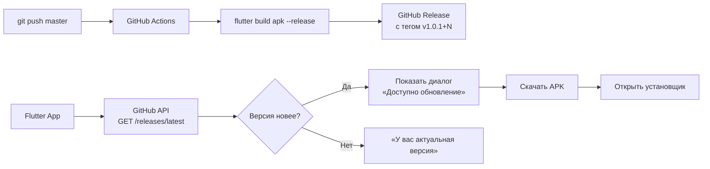

# 📋 План: In-App Updater (вариант 3)

> **Цель:** Автоматическая сборка APK через GitHub Actions + модуль проверки обновлений внутри Flutter-приложения.
> Без Firebase, без сторонних сервисов — только GitHub API.

---

## Архитектура



### Компоненты

| Компонент | Назначение |
|-----------|-----------|
| `.github/workflows/build-apk.yml` | CI/CD сборка APK при пуше |
| `scripts/update_version.sh` | Бамп версии + тег перед сборкой |
| `lib/features/updater/` | Модуль обновлений во Flutter |
| `lib/features/updater/data/github_release.dart` | GitHub API клиент |
| `lib/features/updater/presentation/update_dialog.dart` | UI диалог |
| `lib/features/updater/services/update_service.dart` | Бизнес-логика |
| `android/app/src/main/AndroidManifest.xml` | Права на установку |
| `settings_page.dart` | Кнопка «Проверить обновления» |

---

## 🔴 Фаза 1 — GitHub Actions workflow

**Файлы:**
- Создать: `.github/workflows/build-apk.yml`
- Создать: `.github/workflows/build-apk-preview.yml` (опционально, для PR)

**Что:** При пуше в `master` — сборка APK и создание GitHub Release.

### Workflow:

```yaml
name: Build & Release APK

on:
  push:
    branches: [master]

jobs:
  build:
    runs-on: ubuntu-latest
    permissions:
      contents: write

    steps:
      - uses: actions/checkout@v4

      - name: Setup Flutter
        uses: subosito/flutter-action@v2
        with:
          flutter-version: '3.x'
          channel: 'stable'

      - name: Get version
        id: version
        run: |
          VERSION=$(grep '^version:' app/pubspec.yaml | awk '{print $2}')
          echo "version=$VERSION" >> $GITHUB_OUTPUT

      - name: Install dependencies
        run: cd app && flutter pub get

      - name: Build APK
        run: cd app && flutter build apk --release

      - name: Create Release
        uses: softprops/action-gh-release@v2
        with:
          tag_name: v${{ steps.version.outputs.version }}
          name: "Сборка ${{ steps.version.outputs.version }}"
          body: |
            ## Super App ${{ steps.version.outputs.version }}
            
            См. CHANGELOG.md для подробностей.
            
            ### Установка
            1. Скачай APK ниже
            2. Открой на телефоне
            3. Разреши установку из неизвестных источников
          files: app/build/app/outputs/flutter-apk/app-release.apk
          generate_release_notes: false
```

**Действия:**
1. Создать `.github/workflows/build-apk.yml`
2. Закоммитить и запушить
3. Проверить, что Actions запустился и создал Release

---

## 🟡 Фаза 2 — Модуль обновлений во Flutter

**Файлы:**
- Создать: `app/lib/features/updater/data/github_release.dart`
- Создать: `app/lib/features/updater/services/update_service.dart`
- Создать: `app/lib/features/updater/presentation/update_dialog.dart`

### 2.1 — GitHub Release data model

```dart
// github_release.dart
import 'dart:convert';
import 'package:dio/dio.dart';

class GitHubRelease {
  final String tagName;
  final String name;
  final String body;
  final List<GitHubAsset> assets;
  final String publishedAt;

  const GitHubRelease({
    required this.tagName,
    required this.name,
    required this.body,
    required this.assets,
    required this.publishedAt,
  });

  factory GitHubRelease.fromJson(Map<String, dynamic> json) {
    return GitHubRelease(
      tagName: json['tag_name'] as String? ?? '',
      name: json['name'] as String? ?? '',
      body: json['body'] as String? ?? '',
      assets: (json['assets'] as List? ?? [])
          .map((a) => GitHubAsset.fromJson(a as Map<String, dynamic>))
          .toList(),
      publishedAt: json['published_at'] as String? ?? '',
    );
  }

  /// Парсит версию из тега (v1.0.1+11 → 1.0.1+11)
  String get rawVersion => tagName.startsWith('v') ? tagName.substring(1) : tagName;

  /// Ссылка на первый APK-артефакт
  String? get apkDownloadUrl {
    for (final asset in assets) {
      if (asset.name.endsWith('.apk')) return asset.downloadUrl;
    }
    return null;
  }
}

class GitHubAsset {
  final String name;
  final String downloadUrl;
  final int size;

  const GitHubAsset({
    required this.name,
    required this.downloadUrl,
    required this.size,
  });

  factory GitHubAsset.fromJson(Map<String, dynamic> json) {
    return GitHubAsset(
      name: json['name'] as String? ?? '',
      downloadUrl: json['browser_download_url'] as String? ?? '',
      size: json['size'] as int? ?? 0,
    );
  }
}
```

### 2.2 — Update service

```dart
// update_service.dart
import 'dart:io';
import 'package:dio/dio.dart';
import 'package:app/core/app_version.dart';
import 'package:app/features/updater/data/github_release.dart';

class UpdateService {
  static const String _repoUrl =
      'https://api.github.com/repos/OlegSolomatin/super-app/releases/latest';

  final Dio _dio;

  UpdateService(this._dio);

  /// Проверить наличие обновления.
  /// Возвращает [GitHubRelease] если есть новая версия, иначе null.
  Future<GitHubRelease?> checkForUpdate() async {
    try {
      final response = await _dio.get(
        _repoUrl,
        options: Options(
          headers: {
            'Accept': 'application/vnd.github.v3+json',
            'User-Agent': 'SuperApp-Android',
          },
          // Без авторизации 60 запросов/час — хватит с запасом
        ),
      );

      if (response.statusCode != 200) return null;

      final release = GitHubRelease.fromJson(response.data as Map<String, dynamic>);
      final latestVersion = release.rawVersion;

      if (_isNewer(latestVersion, appVersion)) {
        return release;
      }
      return null;
    } catch (e) {
      debugPrint('[UPDATER] check failed: $e');
      return null;
    }
  }

  /// Сравнить две версии: 1.0.1+11 > 1.0.1+10
  bool _isNewer(String latest, String current) {
    final latestBuild = int.tryParse(latest.split('+').last) ?? 0;
    final currentBuild = int.tryParse(current.split('+').last) ?? 0;
    return latestBuild > currentBuild;
  }

  /// Скачать APK во временную папку.
  Future<String?> downloadApk(GitHubRelease release) async {
    final url = release.apkDownloadUrl;
    if (url == null) return null;

    final dir = Directory.systemTemp.path;
    final filePath = '$dir/super-app-${release.rawVersion}.apk';

    await _dio.download(url, filePath);
    return filePath;
  }
}
```

### 2.3 — Dialog UI

```dart
// update_dialog.dart
import 'package:flutter/material.dart';
import 'package:phosphor_flutter/phosphor_flutter.dart';
import 'package:url_launcher/url_launcher.dart';
import 'package:app/features/updater/data/github_release.dart';

Future<void> showUpdateDialog(
  BuildContext context,
  GitHubRelease release,
) async {
  await showDialog(
    context: context,
    builder: (ctx) => AlertDialog(
      title: Row(
        children: [
          const PhosphorIcon(PhosphorIconsFill.cloudArrowDown, size: 22),
          const SizedBox(width: 10),
          const Text('Доступно обновление'),
        ],
      ),
      content: Column(
        mainAxisSize: MainAxisSize.min,
        crossAxisAlignment: CrossAxisAlignment.start,
        children: [
          Text('Версия: ${release.rawVersion}'),
          const SizedBox(height: 8),
          if (release.body.isNotEmpty)
            Text(
              release.body,
              style: Theme.of(context).textTheme.bodySmall,
              maxLines: 6,
              overflow: TextOverflow.ellipsis,
            ),
        ],
      ),
      actions: [
        TextButton(
          onPressed: () => Navigator.pop(ctx),
          child: const Text('Позже'),
        ),
        FilledButton(
          onPressed: () async {
            final url = release.apkDownloadUrl;
            if (url != null) {
              // Открыть ссылку на скачивание в браузере
              await launchUrl(Uri.parse(url));
            }
            Navigator.pop(ctx);
          },
          child: const Text('Скачать'),
        ),
      ],
    ),
  );
}
```

**Примечание по скачиванию:** Самый простой и надёжный способ — открыть ссылку на APK в браузере. Браузер сам скачает и покажет диалог установки.
- Не требует `flutter_downloader`
- Не требует permission `REQUEST_INSTALL_PACKAGES`
- Работает на Android 10+

Если хочешь скачивание внутри приложения (без браузера) — нужен `flutter_downloader` + `WRITE_EXTERNAL_STORAGE` + `REQUEST_INSTALL_PACKAGES`.

---

## 🟢 Фаза 3 — Интеграция в приложение

**Файлы:**
- Модифицировать: `app/lib/features/settings/presentation/settings_page.dart`
- Модифицировать: `app/lib/features/home/presentation/home_page.dart` (опционально)
- Модифицировать: `app/lib/core/app_version.dart` (уже синхронизирована)

**Что:** Добавить кнопку проверки обновлений в настройки + авто-проверку при запуске.

### Кнопка в настройках

```dart
// В settings_page.dart, в разделе "О приложении"
ListTile(
  leading: const PhosphorIcon(PhosphorIconsFill.cloudArrowDown, size: 20),
  title: const Text('Проверить обновления'),
  subtitle: Text('Текущая версия: $appVersion'),
  onTap: () async {
    final service = UpdateService(context.read<DioClient>().dio);
    final release = await service.checkForUpdate();
    if (!context.mounted) return;
    if (release != null) {
      showUpdateDialog(context, release);
    } else {
      ScaffoldMessenger.of(context).showSnackBar(
        const SnackBar(content: Text('У вас актуальная версия')),
      );
    }
  },
),
```

### Авто-проверка (опционально)

```dart
// В home_page.dart, initState
@override
void initState() {
  super.initState();
  _checkForUpdates();
}

Future<void> _checkForUpdates() async {
  await Future.delayed(const Duration(seconds: 3)); // Подождать загрузку
  final dio = context.read<DioClient>().dio;
  final service = UpdateService(dio);
  final release = await service.checkForUpdate();
  if (!mounted) return;
  if (release != null) {
    showUpdateDialog(context, release);
  }
}
```

---

## 🔴 Фаза 4 — Android-специфичные настройки

**Файлы:**
- Модифицировать: `app/android/app/src/main/AndroidManifest.xml`

**Что:** Добавить права для установки APK.

```xml
<!-- Для Android 8+ — разрешить установку из своего источника -->
<uses-permission android:name="android.permission.REQUEST_INSTALL_PACKAGES" />

<!-- Для скачивания на Android 10 и ниже -->
<uses-permission android:name="android.permission.WRITE_EXTERNAL_STORAGE"
    android:maxSdkVersion="28" />
```

> ⚠️ Если используешь скачивание через браузер (открытие ссылки) — эти права не нужны.

---

## 🚫 НЕ меняем

- `app/lib/core/theme.dart` — тема не трогаем
- `app/lib/core/router.dart` — роутинг не трогаем
- `backend/` — все изменения только во Flutter
- `app/pubspec.yaml` — зависимости (dio уже есть, url_launcher уже есть)

---

## 📦 Зависимости

| Пакет | Статус | Для чего |
|-------|--------|----------|
| `dio` | ✅ Уже есть | HTTP-запросы к GitHub API |
| `url_launcher` | ✅ Уже есть | Открыть ссылку в браузере |
| `flutter_downloader` | ❓ Опционально | Скачать APK внутри приложения |

---

## ⏱ Оценка

| Фаза | Описание | Время |
|------|----------|-------|
| 🔴 1 | GitHub Actions workflow | ~15 мин |
| 🟡 2 | Модуль обновлений (data + service + dialog) | ~25 мин |
| 🟢 3 | Интеграция в настройки + авто-проверка | ~10 мин |
| 🔴 4 | Android-специфика (если нужно) | ~5 мин |
| | **Итого:** | **~55 мин** |

---

## ❓ Вопросы для решения

1. **Скачивание:** через браузер ✅ (проще) или внутри приложения (сложнее, но красивее)?
2. **Авто-проверка:** при каждом запуске или только по кнопке?
3. **Уведомления:** показывать каждый раз при новой версии или раз в день?
