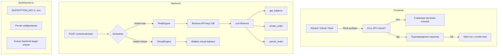

# 📋 План: Real Mode — торговля на реальный баланс Binance

> **Цель:** Добавить режим реальной торговли (Real Mode) в Order Book систему. Стратегии, настройки, визард — без изменений. Меняется только источник баланса и исполнение сделок (реальные ордера на Binance).

---

## Архитектура



---

## 🔴 Фаза 1 — Модель хранения API-ключей

**Файлы:**
- Создать: `backend/app/models/exchange_key.py`
- Модифицировать: `backend/app/models/__init__.py`
- Модифицировать: `backend/app/core/settings.py` — добавить `ENCRYPTION_KEY`
- Модифицировать: `backend/.env` — добавить `ENCRYPTION_KEY`

**Что:** Новая SQLAlchemy модель для хранения зашифрованных API-ключей Binance.

### Модель:

```python
# exchange_key.py
import uuid
from datetime import datetime, timezone
from sqlalchemy import Column, String, DateTime, ForeignKey, Boolean, Text
from sqlalchemy.dialects.postgresql import UUID
from sqlalchemy.orm import relationship
from app.core.database import Base
from cryptography.fernet import Fernet

class ExchangeKey(Base):
    __tablename__ = "exchange_keys"

    id = Column(UUID(as_uuid=True), primary_key=True, default=uuid.uuid4)
    user_id = Column(UUID(as_uuid=True), ForeignKey("users.id"), nullable=False)
    exchange = Column(String(32), nullable=False, default="binance")
    encrypted_api_key = Column(Text, nullable=False)
    encrypted_api_secret = Column(Text, nullable=False)
    is_valid = Column(Boolean, default=False)  # проверен ли ключ
    created_at = Column(DateTime(timezone=True), default=lambda: datetime.now(timezone.utc))
    updated_at = Column(DateTime(timezone=True), onupdate=lambda: datetime.now(timezone.utc))

    user = relationship("User", backref="exchange_keys")

    @staticmethod
    def encrypt_value(value: str, encryption_key: str) -> str:
        f = Fernet(encryption_key.encode())
        return f.encrypt(value.encode()).decode()

    @staticmethod
    def decrypt_value(encrypted: str, encryption_key: str) -> str:
        f = Fernet(encryption_key.encode())
        return f.decrypt(encrypted.encode()).decode()
```

### Settings:

```python
# В settings.py
ENCRYPTION_KEY: str = ""  # Fernet-ключ для шифрования API ключей

@property
def encryption_key(self) -> bytes:
    """Возвращает bytes-ключ для Fernet."""
    return self.ENCRYPTION_KEY.encode() if self.ENCRYPTION_KEY else b""
```

### .env:

```
ENCRYPTION_KEY=your-64-char-fernet-key-here
```

> **Генерация ключа:** `python3 -c "from cryptography.fernet import Fernet; print(Fernet.generate_key().decode())"`

**Действия:**
1. Установить `cryptography`: `pip install cryptography`
2. Создать модель `ExchangeKey`
3. Добавить поле `ENCRYPTION_KEY` в settings
4. Сгенерировать ключ и добавить в .env
5. Создать миграцию Alembic

---

## 🔴 Фаза 2 — API для управления ключами

**Файлы:**
- Создать: `backend/app/schemas/exchange_key.py`
- Создать: `backend/app/api/v1/exchange_keys.py`
- Модифицировать: `backend/app/core/dependencies.py` — добавить `get_session` (уже есть)
- Модифицировать: `backend/app/main.py` — добавить роутер

**Что:** CRUD endpoints для API-ключей. Фронт НЕ видит сами ключи — только статус.

### Schemas:

```python
class ExchangeKeySaveRequest(BaseModel):
    api_key: str = Field(..., min_length=10, max_length=256)
    api_secret: str = Field(..., min_length=10, max_length=512)

class ExchangeKeyStatusResponse(BaseModel):
    has_keys: bool
    exchange: str | None
    is_valid: bool | None
    created_at: datetime | None

class ExchangeKeyResponse(BaseModel):
    id: UUID
    exchange: str
    is_valid: bool
    created_at: datetime
```

### Endpoints:

```
POST   /api/v1/user/exchange-keys      — сохранить/обновить ключи
GET    /api/v1/user/exchange-keys/status — проверить, есть ли ключи
DELETE /api/v1/user/exchange-keys      — удалить ключи
POST   /api/v1/user/exchange-keys/verify — проверить валидность ключей (ping Binance API)
```

**POST /save:**
1. Получить `api_key` и `api_secret` из тела запроса
2. Зашифровать через `Fernet`
3. Сохранить в БД (upsert по user_id + exchange)
4. Вернуть `ExchangeKeyResponse` (без самих ключей!)

**GET /status:**
1. Проверить, есть ли запись для текущего пользователя
2. Вернуть `{has_keys: true/false, is_valid: ...}`

**DELETE:**
1. Удалить запись из БД

**POST /verify:**
1. Попробовать получить баланс с Binance через ccxt
2. Если успешно → `is_valid = True`
3. Если ошибка (401) → `is_valid = False`, вернуть ошибку

---

## 🔴 Фаза 3 — RealEngine

**Файлы:**
- Создать: `backend/app/services/trading/orderbook/real_engine.py`
- Модифицировать: `backend/app/services/trading/orderbook/engine.py` — выделить общий базовый класс (опционально)
- Модифицировать: `backend/app/services/trading/scheduler.py` — поддержка mode=real
- Модифицировать: `backend/app/api/v1/orderbook.py` — передача mode

**Что:** OrderBookEngine, который вместо виртуального баланса использует реальный с Binance и отправляет реальные ордера.

### RealEngine — ключевые отличия от Virtual:

| Аспект | VirtualEngine | RealEngine |
|--------|---------------|------------|
| Баланс | `Wallets(initial_balance=...)` | `ccxt.binance.fetch_balance()` |
| Сделки | Симуляция (entry_price × amount) | `ccxt.binance.create_market_order()` |
| Комиссия | 0.1% (фикс) | Реальная комиссия с Binance |
| Стоп-лосс | Симуляция PnL | `create_stop_loss_order()` |
| Проскальзывание | Не моделируется | Реальное проскальзывание |

### Псевдокод:

```python
class RealOrderBookEngine(OrderBookEngine):
    """Engine для реальной торговли на Binance."""

    def __init__(self, config, api_key, api_secret):
        super().__init__(config)
        self.exchange = ccxt.binance({
            'apiKey': api_key,
            'secret': api_secret,
        })

    async def refresh_balance(self):
        """Обновить реальный баланс USDT."""
        bal = await self.exchange.fetch_balance()
        free = bal['USDT']['free']
        total = bal['USDT']['total']
        self.wallets = RealWallets(total, free)

    async def execute_signal(self, signal):
        """Отправить реальный ордер на Binance."""
        order = await self.exchange.create_market_buy_order(
            symbol=signal.pair,
            amount=stake_amount,
        )
        # Трекинг ордера
        return RealTrade(order)
```

### RealWallets:

```python
class RealWallets:
    """Прокси для реального баланса Binance."""
    def __init__(self, total, free):
        self._total = total
        self._free = free

    @property
    def total_balance(self) -> float:
        return self._total

    @property
    def free_balance(self) -> float:
        return self._free

    def get_trade_stake_amount(self, pair, **kwargs):
        # Использовать процент от реального баланса
        return self._free * 0.1  # 10% от свободного баланса
```

---

## 🟡 Фаза 4 — Модификация scheduler для real mode

**Файлы:**
- Модифицировать: `backend/app/services/trading/scheduler.py`
- Модифицировать: `backend/app/api/v1/orderbook.py`

**Что:** При старте OB с `mode=real` — получить ключи из БД, расшифровать, создать RealEngine.

### В scheduler.start_orderbook_run():

```python
async def start_orderbook_run(self, run_id, config, current_user=None):
    ob_config = OrderBookConfig(**config)

    if config.get("mode") == "real":
        # Получить и расшифровать ключи
        key_record = await self._get_user_keys(current_user.id)
        if not key_record:
            raise ValueError("API-ключи не настроены")

        engine = RealOrderBookEngine(
            config=ob_config,
            api_key=key_record.decrypted_api_key,
            api_secret=key_record.decrypted_api_secret,
        )
    else:
        engine = OrderBookEngine(ob_config)

    self._engines[run_id] = engine
    task = asyncio.create_task(self._run_orderbook_engine(run_id, engine, ob_config))
    self._tasks[run_id] = task
```

### API endpoint orderbook/start:

```python
# В OrderBookStartRequest добавить:
mode: str = Field(default="virtual", pattern="^(virtual|real)$")
```

---

## 🟢 Фаза 5 — Режим «Real Mode» на фронте

**Файлы:**
- Модифицировать: `app/lib/features/trading/presentation/trading_page.dart` — модалка выбора режима
- Модифицировать: `app/lib/features/trading/presentation/orderbook_wizard_page.dart` — передача mode
- Создать: `app/lib/features/settings/presentation/exchange_keys_page.dart` — страница настройки ключей
- Модифицировать: `app/lib/features/settings/presentation/settings_page.dart` — добавить пункт меню
- Создать: `app/lib/features/settings/data/exchange_keys_repository.dart` — API клиент

### 5.1 — Модалка выбора режима

Убрать заглушку "⛔ Скоро", добавить активную карточку "Real Mode":

```dart
// Real mode — теперь активен, но проверяет API-ключи
GestureDetector(
  onTap: () async {
    Navigator.pop(ctx);
    final hasKeys = await _checkExchangeKeys();
    if (!hasKeys && mounted) {
      // Показать диалог: "Настройте API-ключи"
      _showKeysRequiredDialog(context);
      return;
    }
    context.go('/trading/orderbook-wizard?mode=real');
  },
  child: Container(
    // ... та же карточка, но с зелёной рамкой вместо серой
    // и бейджем "Готов" вместо "Скоро"
  ),
)
```

### 5.2 — Страница настройки API-ключей

```dart
class ExchangeKeysPage extends StatefulWidget { ... }

// UI:
//   - Поле: API Key (TextFormField, obscured)
//   - Поле: Secret Key (TextFormField, obscured)
//   - Кнопка: "Сохранить и проверить"
//   - Индикатор статуса: "Ключи валидны ✅" / "Неверные ключи ❌"
//   - Кнопка: "Удалить ключи"
//   - Предупреждение: "⚠️ Никогда не передавайте ключи третьим лицам"
```

### 5.3 — Интеграция с визардом

В `orderbook_wizard_page.dart`:
- При `mode=real` — скрыть слайдеры баланса (баланс с биржи)
- Добавить индикатор: "Real Mode | Баланс: $123.45 USDT"
- Показать дополнительное предупреждение: "Реальные сделки будут отправлены на Binance"

---

## 🔴 Фаза 6 — Безопасность

**Файлы:**
- Модифицировать: `backend/app/core/settings.py`
- Модифицировать: `backend/.env`
- Создать: `backend/app/core/encryption.py`

**Что:** Шифрование ключей, логирование, защита от повторного использования.

### 6.1 — Шифрование

```python
# encryption.py
from cryptography.fernet import Fernet
from app.core.settings import settings

_fernet: Fernet | None = None

def get_fernet() -> Fernet:
    global _fernet
    if _fernet is None:
        key = settings.ENCRYPTION_KEY
        if not key:
            raise RuntimeError("ENCRYPTION_KEY not configured")
        _fernet = Fernet(key.encode())
    return _fernet

def encrypt_api_key(plain: str) -> str:
    return get_fernet().encrypt(plain.encode()).decode()

def decrypt_api_key(encrypted: str) -> str:
    return get_fernet().decrypt(encrypted.encode()).decode()
```

### 6.2 — Ограничения real mode

```python
# В scheduler.py
MAX_REAL_RUNS = 3  # максимум 3 real-mode запуска одновременно
REAL_MODE_COOLDOWN = 60  # секунд между запусками

def can_start_real_mode(self, user_id) -> bool:
    """Проверить, можно ли запустить real mode."""
    active_real = sum(
        1 for e in self._engines.values()
        if isinstance(e, RealOrderBookEngine)
    )
    return active_real < self.MAX_REAL_RUNS
```

### 6.3 — Логирование

```python
# Все real-mode операции логируются с user_id
logger.info(f"[REAL] User {user_id} started real OB run {run_id}")
logger.info(f"[REAL] User {user_id} created order {order_id} for {pair}")
```

---

## 🟢 Фаза 7 — UI для Real Mode на странице трейдинга

**Файлы:**
- Модифицировать: `app/lib/features/trading/presentation/trading_page.dart`

**Что:** Показать активные real-mode запуски с отличительным значком.

```dart
// В карточке активного запуска:
Container(
  padding: const EdgeInsets.symmetric(horizontal: 6, vertical: 2),
  decoration: BoxDecoration(
    color: run.isReal ? PfColors.warning.withValues(alpha: 0.15) : Colors.transparent,
    borderRadius: PfRadius.borderRadiusPill,
  ),
  child: Row(
    mainAxisSize: MainAxisSize.min,
    children: [
      if (run.isReal)
        PhosphorIcon(PhosphorIconsFill.warningCircle, size: 12, color: PfColors.warning),
      const SizedBox(width: 4),
      Text(run.isReal ? 'Real' : 'Virtual'),
    ],
  ),
)
```

---

## 🟢 Фаза 8 — Балансовый мониторинг

**Файлы:**
- Модифицировать: `backend/app/services/trading/scheduler.py` — live status для real mode
- Модифицировать: `backend/app/api/v1/orderbook.py` — эндпоинт реального баланса

**Что:** Показывать реальный баланс Binance на странице трейдинга (даже без активного запуска).

```dart
// GET /api/v1/user/real-balance — возвращает баланс USDT
{
  "total": 1234.56,
  "free": 1000.00,
  "in_order": 234.56,
  "updated_at": "2026-06-09T14:00:00Z"
}
```

---

## 🚫 НЕ меняем

- `backend/app/services/trading/orderbook/strategies/*.py` — логика стратегий не трогаем
- `backend/app/services/trading/orderbook/models.py` — `OrderBookConfig` почти не меняем (только mode поле)
- `backend/app/services/trading/orderbook/binance_stream.py` — WS-поток для данных (не для ордеров)
- `app/lib/features/trading/data/strategy_names.dart` — названия стратегий
- `app/lib/features/trading/presentation/orderbook_run_detail_page.dart` — страница деталей

---

## 📦 Новые зависимости

| Пакет | Для чего |
|-------|----------|
| `cryptography` (бэкенд) | Шифрование API-ключей Fernet |
| `ccxt` (бэкенд) | Уже есть! Взаимодействие с Binance API |

Фронт: никаких новых зависимостей.

---

## ⏱ Оценка

| Фаза | Описание | Время |
|------|----------|-------|
| 🔴 1 | Модель API-ключей + шифрование + миграция | ~30 мин |
| 🔴 2 | API endpoints для ключей (save/status/delete/verify) | ~25 мин |
| 🔴 3 | RealEngine + RealWallets | ~40 мин |
| 🟡 4 | Модификация scheduler + API для mode=real | ~20 мин |
| 🟢 5 | Фронт: страница ключей + модалка режима + визард | ~35 мин |
| 🔴 6 | Безопасность: лимиты, логирование, защита | ~15 мин |
| 🟢 7 | UI для real mode на странице трейдинга | ~10 мин |
| 🟢 8 | Балансовый мониторинг (опционально) | ~15 мин |
| | **Итого:** | **~3 часа 10 мин** |

---

## ⚠️ Риски

| Риск | Вероятность | Решение |
|------|-------------|---------|
| Потеря средств из-за бага в engine | 🔴 Высокая | Ограничить real mode: макс. 3 запуска, малый % баланса на сделку |
| API-ключи с read-only правами | 🟡 Средняя | Проверять права при verify: если нет trade permission — ошибка |
| Binance rate limits | 🟡 Средняя | Добавить rate limiter для ордеров (макс. 10/сек) |
| Проскальзывание на market orders | 🟢 Низкая | Для реальных сделок использовать limit orders |

---

## 🔑 Ключевые решения до старта

1. **Размер ставки в % от баланса** — какой % свободного баланса рисковать на сделку? (Рекомендую: 5-10% для начала)
2. **Тип ордеров** — market (мгновенно, проскальзывание) или limit (гарантированная цена, медленнее)?
3. **Тестовый режим** — сначала на Binance Testnet (testnet.binance.com) или сразу на реальный?
